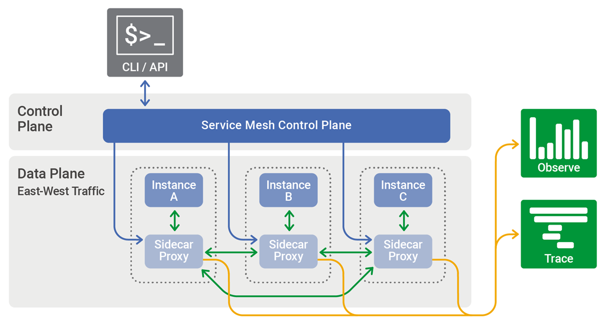

# Service Mesh Learning
This repository contains information and examples I used to learn more about
service mesh tools, approaches and patterns.

## What Is a Service Mesh?
A service mesh is a programmable framework that provides capabilities such as
traffic control, service discovery, load balancing, robustness, observability
and security to your service architecture. A service mesh allows services to
offload these capabilities, allowing developers to focus on differentiating
business logic.

The service mesh is usually implemented by providing a proxy instance, called a
sidecar, for each service instance. Sidecars handle interservice
communications, monitoring, and security‑related concerns – indeed, anything
that can be abstracted away from individual services. This way, developers can
focus on development, support, and maintenance for the application code in the
services; operations teams can maintain the service mesh and run the app.

The part of a service mesh application that manages the network traffic between
instances is called the `data plane`. Generating and deploying the
configuration that controls the data plane’s behaviour is done using a separate
`control plane`. The control plane typically includes, or is designed to
connect to, an API, a command‑line interface, and a graphical user interface
for managing the app.

## Service Meshes
There are several service mesh implementations. I started my service mesh
learning journey with [Envoy][].

### Envoy
[Envoy][] is an open-source edge and service proxy, designed for cloud native
applications. It is a high-performance C++ distributed proxy designed for
single services and applications, as well as a communication bus and “universal
data plane” designed for large microservice “service mesh” architectures.

[Envoy]: https://www.envoyproxy.io/

## Resources

* [Istio: Up and Running - O'Reilly Books](http://shop.oreilly.com/product/0636920203940.do)
* [What is a Service Mesh? - NGINX Blog](https://www.nginx.com/blog/what-is-a-service-mesh/)
